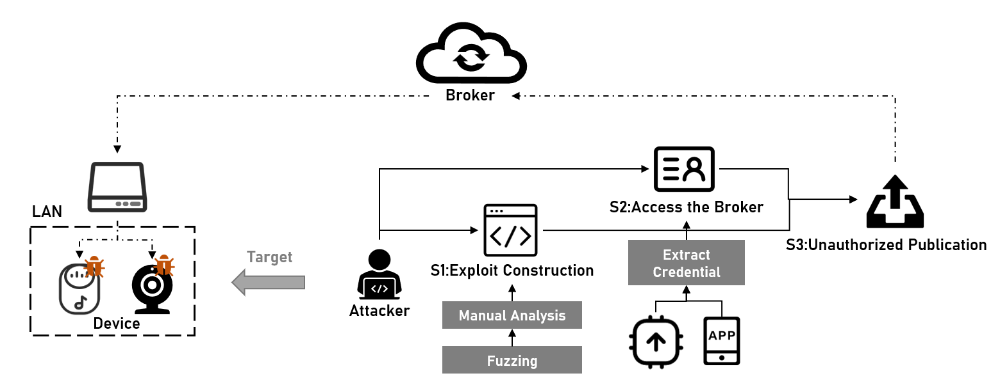
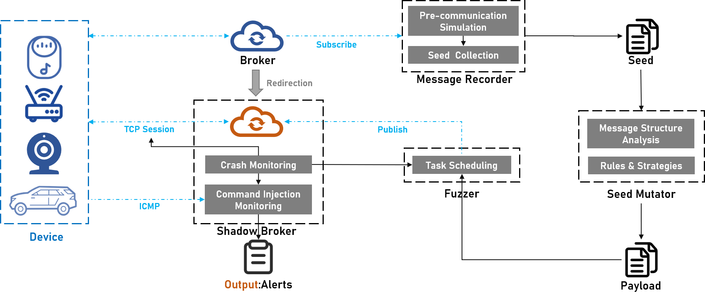

# ShadowFuzzer

The ShadowFuzzer is a fuzzing framework to find client-side vulnerabilities when processing incoming MQTT messages. 

## Paper 

- [Trampoline Over the Air: Breaking in IoT Devices Through MQTT Brokers](https://github.com/ReAbout/Trampoline-Over-the-Air/blob/main/Trampoline%20Over%20the%20Air%20-%20Breaking%20in%20IoT%20Devices%20Through%20MQTT%20Brokers_validated.pdf)

>Huikai Xu, Miao Yu, Yanhao Wang, Yue Liu, Qinsheng Hou, Zhenbang Ma, Haixin Duan, Jianwei Zhuge and Baojun Liu.
Processdings of The 7th IEEE European Symposium on Security and Privacy, (EuroS&P)
Genoa, June 6-10, 2022

## Attack Model

The attack targets are the IoT devices communicating with the MQTT broker. The adversary aims to leverage the broker as a trampoline to transfer
exploit messages to the target devices to trigger the vulnerabilities when processing the MQTT payload.

## Overview of ShadowFuzzer

## How to use?

### Build ShadowBroker

First build the [ShadowBroker](./ShadowBroker/README.md) and make the device (subscriber) to connect to the ShadowBroker by DNS redirection or other tricks.

### Fuzzing
Boot the [fuzzer](./Fuzzer/README.md)
